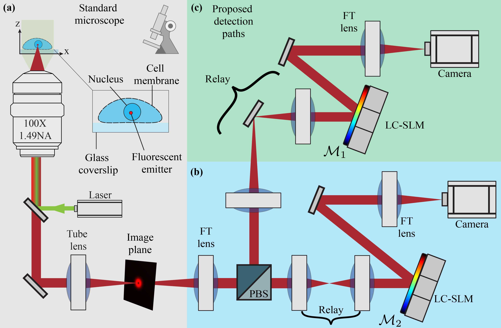
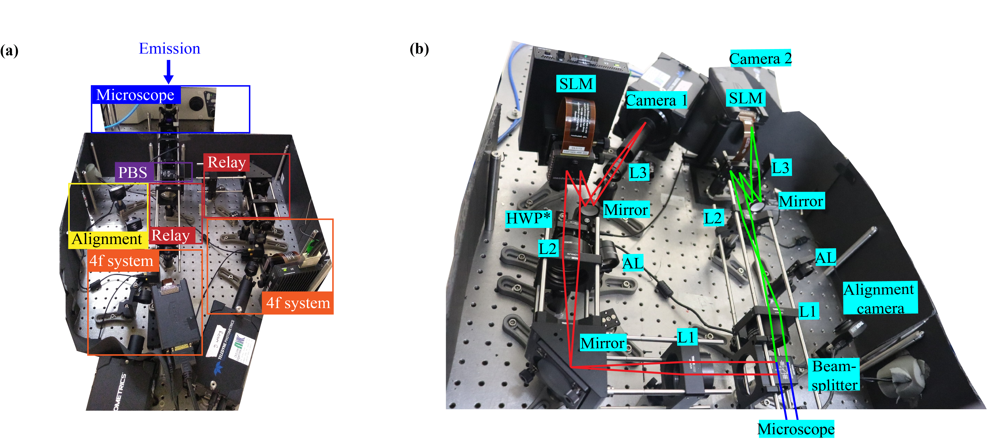
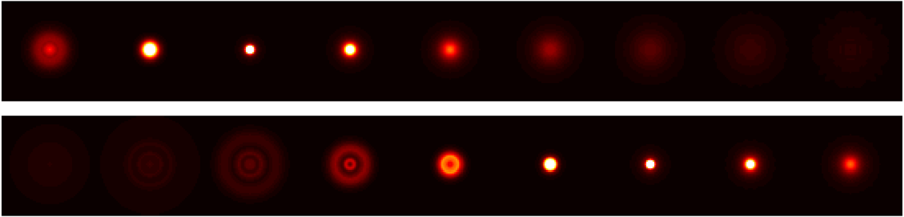
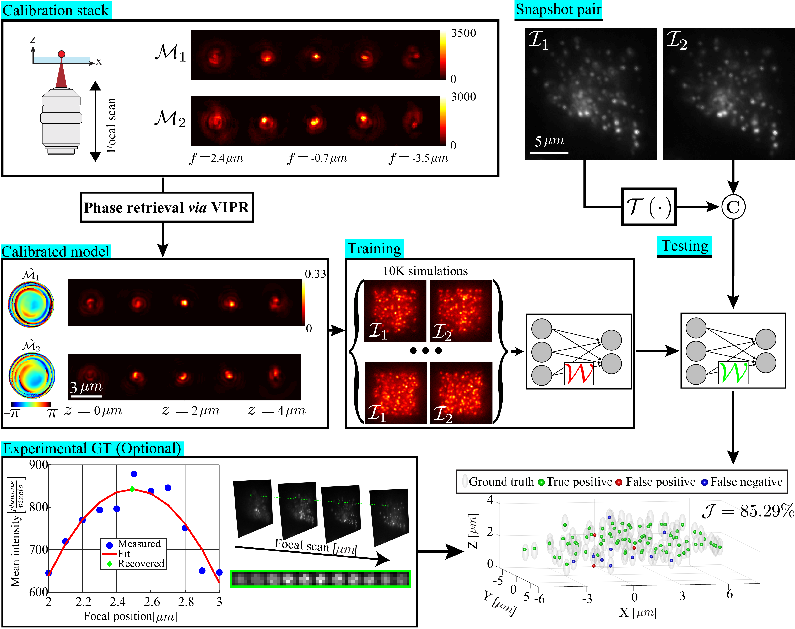
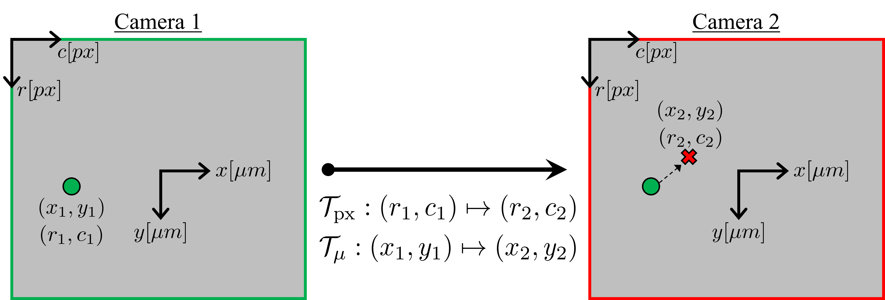
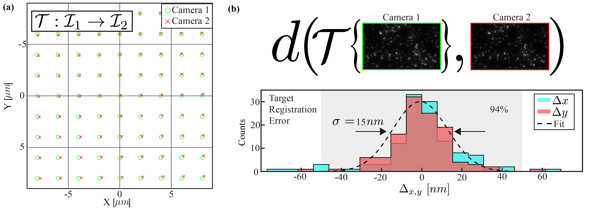

# DeepNebulae

This code accompanies the paper: ["Learning optimal wavefront shaping for
multi-channel imaging"](https://tomer.net.technion.ac.il/files/2021/07/PAMI_Camera_Ready_Final_Version.pdf) which was presented at the IEEE 13th International Conference on Computational Photography (ICCP 21), and selected for publication in a special issue of IEEE Transactions on Pattern Analysis and Machine Intelligence (TPAMI).


# Contents

- [Overview](#overview)
- [Optical setup](#optical-setup)
- [Proposed PSFs](#proposed-psfs)
- [Video recording](#video-recording)
- [Other PSFs](#other-psfs)
- [System requirements](#system-requirements)
- [Installation instructions](#installation-instructions)
- [Code structure](#code-structure)
- [Demo examples](#demo-examples)
- [Learning a localization model](#learning-a-localization-model)
- [Channel registration](#channel-registration)
- [Linking trajectories in tracking](#linking-trajectories-in-tracking)
- [Citation](#citation)
- [License](#license)
- [Contact](#contact)

# Overview

This code implements two different applications of CNNs in dense 3D localization microscopy:
1. Learning a 3D localization CNN for a given fixed pair of PSFs.


2. Learning an optimized pair of PSFs for high-density localization via end-to-end optimization.

https://github.com/user-attachments/assets/3ecf7e85-1733-4e54-9ea7-ffdad1431f43

There's no need to download any dataset as the code itself generates the training and the test sets. Demo 1 illustrates how to train a localization model based on retreived phase masks and channel alignment, and demo 4 illustrates how the method can be used to learn optimzied phase masks. The remaining demos evaluate pre-trained models on both simulated and experimental data.

# Optical setup

In our work we used the following bifurcated optical system. (a) A standard inverted microscope with laser illumination. (b-c) Two imaging paths, split by polarization, employing two spatial light modulators placed in conjugate back focal planes to the objective lens. Each optical path can be modulated with a different phase mask ($\mathcal{M}_1$ & $\mathcal{M}_2$).



# Proposed PSFs

Provided in this repository are three different propsoed PSF pairs, each derived through different considerations.


# Video recording

To get a better grasp of the system and methods proposed in our work click the image below to watch the 12 min talk presented at the IEEE 13th International Conference on Computational Photography (ICCP 21).

[](http://www.youtube.com/watch?v=SxISC2O4qRI&t=8868s "ICCP Paper Talk")

 # Other PSFs

In our work the sample was imaged with a rather complicated optical setup. This setup consisted of (a) An epifluorescence microscope (blue) where the emission was split by a polarizing beam splitter (purple), and relayed (red) into two identical 4f systems (orange), each equipped with a LC-SLM at the back focal plane. (b) Light path for camera 1 (red) and camera 2 (green), where an optional Half Wave Plate (HWP*) was added to the red path to rotate the polarization.



Nonetheless, the localization technique presented in this work is also applicable to simpler optical setups using other PSF pairs, such as for example the bi-plane PSFs which can be induced by simple defocusing between the two imaging channels:




`demo6.py` demonstrates the usage of this code for localization of simulated biplane data to illustrate this point.

# System requirements
* The software was tested on a *Linux* system with Ubuntu version 18.0, and a *Windows* system with Windows 10 Home.  
* Training and evaluation were run on a standard workstation equipped with 32 GB of memory, an Intel(R) Core(TM) i7 − 8700, 3.20 GHz CPU, and a NVidia GeForce Titan Xp GPU with 12 GB of video memory.

# Installation instructions
1. Download this repository as a zip file (or clone it using git).
2. Go to the downloaded directory and unzip it.
3. The [conda](https://docs.conda.io/en/latest/) environment for this project is given in `environment_<os>.yml` where `<os>` should be substituted with your operating system. For example, to replicate the environment on a linux system use the command: `conda env create -f environment_linux.yml` from within the downloaded directory.
This should take a couple of minutes.
4. After activation of the environment using: `conda activate deep-nebulae`, you're set to go!

# Code structure
 
* Data generation
    * `DeepNebulae/physics_utils.py` implements the forward physical model relying on Fourier optics.
    * `DeepNebulae/GeneratingTrainingExamples.py` generates the training examples (either images + 3D locations as in demo1 or only 3D locations + intensities as in demo4). The assumed physical setup parameters are given in the script `Demos/parameter_setting_demo1.py`. This script should be duplicated and altered according to the experimental setup as detailed in `Docs/demo1_documentation.pdf`.
    * `DeepNebulae/data_utils.py` implements the positions and photons sampling, and defines the dataset classes.
    * The folder `Mat_Files` includes phase masks and transforms needed to run the demos.
* CNN models and loss function
    * `DeepNebulae/cnn_utils.py` this script contains the two CNN models used in this work.
    * `DeepNebulae/loss_utils.py` implements the loss function, and an approximation of the Jaccard index.
* Training scripts
    * `DeepNebulae/Training_Localization_Model.py` this script trains a localization model based on the pre-calculated training and validation examples in `GeneratingTrainingExamples.py`. Here, the phase masks are assumed to be fixed (either off-the-shelf or learned), and we're only interested in a dense localization model.
    * `DeepNebulae/PSF_Learning.py` this script learns a pair of optimized PSFs. The training examples in this case are only simulated 3D locations and intensities.
* Post-processing and evaluation
    * `DeepNebulae/postprocessing_utils.py` implements 3D local maxima finding and CoG estimation with a fixed spherical diameter on GPU using max-pooling.
    * `DeepNebulae/Testing_Localization_Model.py` evaluates a learned localization model on either simulated or experimental images. In demo2/demo6 this module is used with pre-trained weights to localize simulated data. In demo3/demo5 it is used to localize experimental data.
    * `DeepNebulae/assessment_utils.py` - this script contains a function that calculates the Jaccard index and the RMSE in both the axial and lateral dimensions given two sets of points in 3D.
* Visualization and saving/loading 
    * `DeepNebulae/vis_utils.py` includes plotting functions.
    * `DeepNebulae/helper_utils.py` includes saving/loading functions.

 # Demo examples
 
* There are 6 different demo scripts that demonstrate the use of this code:
    1. `demo1.py` - learns a CNN for localizing high-density emitters using the PSFs of Method 1 (Tetrapod + newly designed EDOF) using telomere imaging conditions. The script simulates training examples before learning starts. It takes approximately 30 hours to train a model from scratch on a Titan Xp. Note that using the same script of demo1 with a different `parameter_setting_*.py` file, you can similarly learn a localization model for any other PSF pair.
    2. `demo2.py` - evaluates three pre-trained CNNs with the PSFs of Methods 1-3 for localizing high-density simulated data (Fig. 8 main text). The script plots the simulated inputs and the regenerated images, and also compares the recovery with the GT positons in 3D. This demo takes a few seconds to run on a Titan Xp.
    3. `demo3.py` - evaluates the same three pre-trained CNNs for localizing experimental snapshots of U2OS cell nuclei with fluorescently-tagged telomeres (Fig. 9 main text). The script plots the input images with the localizations overlaid as red crosses on top. The cell data can be switched from 'FixedCell1' to 'FixedCell2' in `Experimental_Data/FixedCell{*}`. The resulting localizations with each of the 3 methods are compared in 3D, and all results are saved in a mat file under the current working directory. This demo takes a few seconds to run on a Titan Xp.
    4. `demo4.py` - learns an optimized PSF pair from scratch. The learned phase masks and corresponding PSFs are plotted each 5 batches in the first 4 epochs, and afterwards only once each 50 batches. Learning takes approximately 30 hours to converge on a Titan Xp.
    5. `demo5.py` - evaluates a pre-trained CNN for localizing a sequence of experimental snapshot measurements of telomeres in a live U2OS cell nucleus with the learned PSFs. The provided time lapse data in `Experimental_Data/LiveCell` consists of 500 frames taken with 100ms exposure time, spanning a 50s time window. This demo takes about 1.5 minutes to run on a Titan Xp.
    6. `demo6.py` - evaluates a pre-trained CNN for localizing high-density simulated data with the biplane PSFs. The script plots the simulated inputs and the regenerated images, and also compares the recovery with the GT positons in 3D. This demo takes a few seconds to run on a Titan Xp.

* The `Demos` folder includes the following:
    * `Results_oracle` contains pre-trained model weights with the Tetrapod + EDOF PSFs (Method 1) and training metrics needed to run demo2 and demo3.
    * `Results_crlb` contains pre-trained model weights with the CRLB PSFs (Method 2) and training metrics needed to run demo2 and demo3.
    * `Results_learned_fixed` contains pre-trained model weights with the learned PSFs (Method 3) and training metrics needed to run demo2 and demo3.
    * `Results_learned_tracking` contains pre-trained model weights with the learned PSFs (Method 3) and training metrics needed to run demo5.
    * `Results_biplane` contains pre-trained model weights and training metrics needed to run demo6.
    * `parameter_setting_{oracle,crlb,learned_fixed}` contains the specified setup parameters for each of the 3 methods used to train the respective localization models used in demo2/3. Training for each method was carried out using demo1 with the corresponding parameter setting. 
    * `parameter_setting_learned_tracking` contains the specified setup parameters used to train the localization model with the learned PSFs in demo5 for telomere tracking.
    * `parameter_setting_biplane` contains the specified setup parameters for the biplane PSFs used to train the localization model in demo6.

* The `Experimental_data` folder includes the following:
    * `FixedCell{*}` contains snapshots of two different U2OS cell nuclei with tagged telomeres imaged with each of the 3 methods (Fig. 9 main text).
    * `LiveCell` contains a time lapse of 500 frames of fluroescently tagged telomeres diffusing in a live U2OS cell nucleus imaged with the learned PSFs (Method 3).

# Learning a localization model

To learn a localization model for your setup, you need to supply calibrated phase masks and channel registration transforms (e.g. using beads on the coverslip), and generate a new parameter settings script similar to the ones in the `Demos` folder. Below is typical experiment flow in our work, with the alst step of experimental GT derivation being optional, utilized only for quality control. See [next section](#channel-registration) for more details on the transform $\mathcal{T}$ that warps the image $\mathcal{I}_1$ to align it with the image $\mathcal{I}_2$.



The `Docs` folder includes the pdf file `demo1_documentation.pdf` with snapshots detailing the steps in `demo1.py` to ease the user introduction to DeepNebulae. Please go through these while trying `demo1.py` to get a grasp of how the code works.

# Channel registration

Note that for optimal performance, we warp the images of the two channels to the same coordinate system prior to localization with a CNN. This is because CNNs are generally unable to efficiently cope with a random global transform. In this code, we assume access to two transforms mapping between the imaging channels, both of which are calibrated to map from camera 1 to camera 2. The difference between the two transforms is in their units and point of origin:
* $\mathcal{T}_{\text{px}}$ - translates image positions in px, calculated with respect to the top left corner of the FOV.
* $\mathcal{T}_{\mu}$ - translates emitter positions in $\mu m$, calculated with respect to the center of the FOV.



In our experiments, we used calibration samples consisting of beads adhered to the surface with 1% Polyvinyl alcohol (PVA). The beads in each image were localized with ThunderSTORM, and a customized MATLAB routine was used to estimate the above metnioned channel transforms (not included in this code). This led to a calibration error on the order of $<50$ nm, where our pixel size after magnification was 110 nm. While we do not provide the calibration code in this repository, we believe that similar results can be achieved using standard python libraries (e.g. scikit-image), with a code similar to the one in [this tutorial](https://scikit-image.org/docs/stable/auto_examples/transform/plot_matching.html).



# Linking trajectories in tracking

In `demo5.py` we demonstrate the raw localizations recovered by the network over time, without any trajectory filtering, linking, or post-processing. However, in the paper (Fig. 10), the per-frame localizations were linked using a simple [DBSCAN clustering](https://scikit-learn.org/dev/modules/generated/sklearn.cluster.DBSCAN.html) step applied directly to the 3D positions. The maximum distance allowed between points was $\varepsilon = 0.25 \mu m$, and the minimal number of emitters per cluster was `minPts=25`. This resulted in filtering 83 localizations out of 24530 throughout the 500
frames, i.e. less than 0.3%. Nonetheless, if your data demonstrates a more complicated tracking scenario, we encourage you to link the CNN localizations by
resorting to a more robust tracking software such as [TrackMate](https://imagej.net/plugins/trackmate/).

https://github.com/user-attachments/assets/263a43e5-c2cb-43b0-bd14-27d76dfa4454

# Citation

If you use this code for your research, please cite our paper:
```
@article{nehme2021learning,
  title={Learning optimal wavefront shaping for multi-channel imaging},
  author={Nehme, Elias and Ferdman, Boris and Weiss, Lucien E and Naor, Tal and Freedman, Daniel and Michaeli, Tomer and Shechtman, Yoav},
  journal={IEEE Transactions on Pattern Analysis and Machine Intelligence},
  volume={43},
  number={7},
  pages={2179--2192},
  year={2021},
  publisher={IEEE}
}
```

# License
 
This project is covered under the [**MIT License**](https://github.com/EliasNehme/DeepNebulae/blob/master/LICENSE).

# Contact

To report any bugs, suggest improvements, or ask questions, please contact me at "seliasne@gmail.com"

